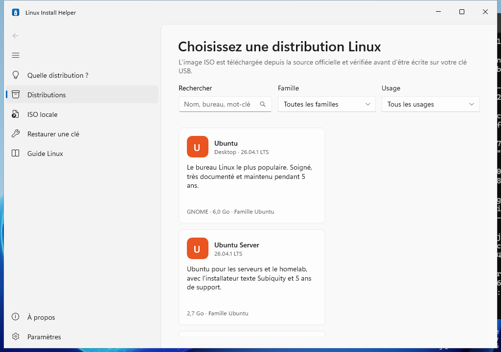
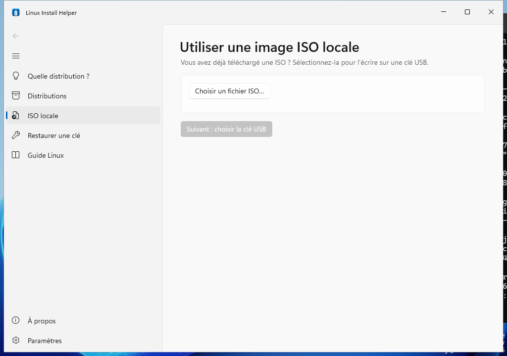
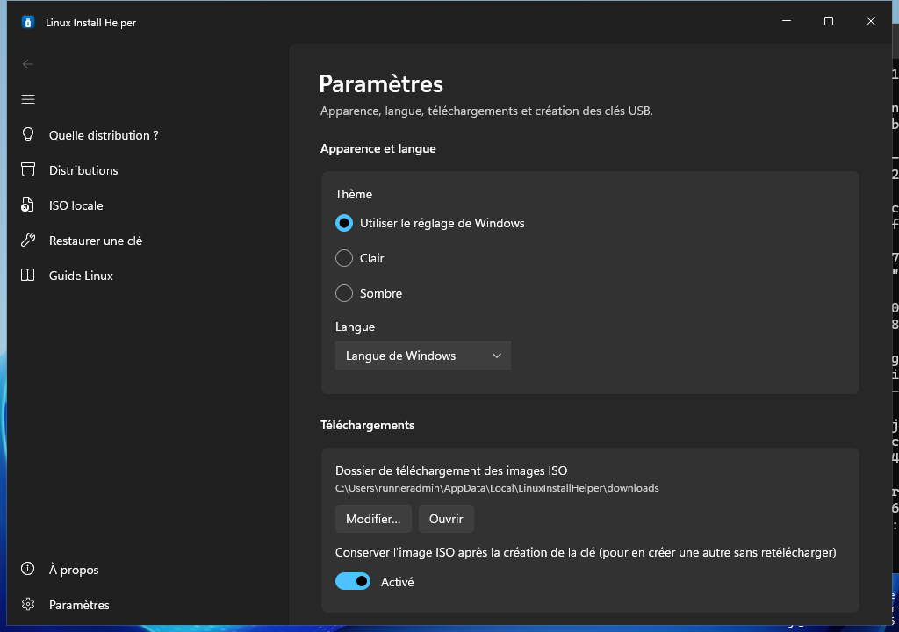
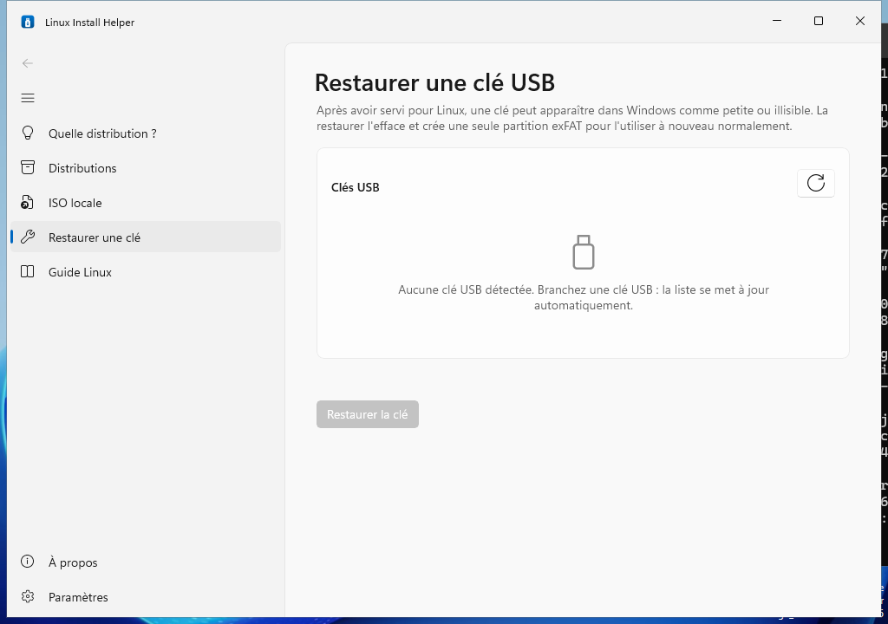
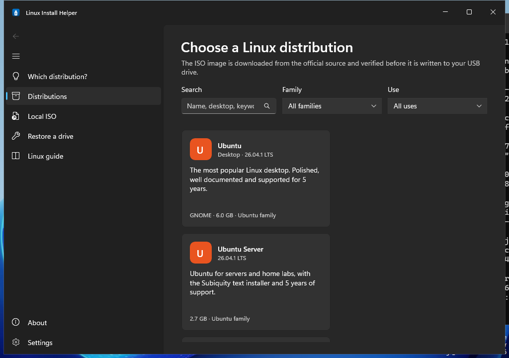

# Linux Install Helper

[](https://github.com/memton80/linux-install-helper/actions/workflows/build.yml)
[](https://github.com/memton80/linux-install-helper/actions/workflows/check-links.yml)
[](LICENSE)

Application Windows native pour créer une **clé USB bootable Linux en quelques clics** : vous choisissez une
distribution, l'application télécharge l'image ISO officielle, la vérifie (checksum et signature OpenPGP),
puis l'écrit sur la clé USB.

*English: a native Windows app that downloads the official ISO of a Linux distribution, verifies it
(checksum and OpenPGP signature) and writes it to a USB drive. The interface is available in English and
French. See [In English](#in-english) below.*



## Fonctionnalités

- **Catalogue de 15 distributions** (Ubuntu, Debian, Linux Mint, Fedora, Arch, openSUSE, Pop!_OS, Kali,
  Manjaro, Zorin OS…) avec recherche et filtres par famille et par usage (bureau, léger, serveur…).
  Le catalogue est mis à jour en ligne au lancement, avec une copie embarquée pour fonctionner hors ligne.
- **Téléchargement automatique** depuis les sources officielles : progression, vitesse, temps restant,
  reprise après coupure, annulation, miroir de secours. Les liens sont testés avant le téléchargement.
- **Vérification avant écriture** : SHA-256 (ou SHA-512) officiel, signature OpenPGP des checksums ou de
  l'ISO quand la distribution en publie une (clés épinglées par empreinte). En cas d'échec : arrêt et message clair.
- **Choix de la clé sans risque** : seules les clés USB amovibles sont proposées ; le disque système et les
  disques internes ne le sont jamais. Double confirmation explicite, puis nouvelle vérification de la clé juste
  avant l'effacement.
- **Écriture fiable** avec progression, relecture de la clé pour la comparer à l'image, journal détaillé et
  éjection propre.
- **ISO locale** : utilisez une image déjà téléchargée, avec contrôle facultatif de son SHA-256.
- **Restaurer une clé** : après usage, la clé est effacée et reformatée en exFAT pour redevenir une clé normale.
- Interface **Windows 11** (WinUI 3, Mica, thème clair/sombre automatique, couleur d'accentuation), en
  **français et en anglais**.

| | |
|---|---|
|  |  |
|  |  |

## Installation

1. Téléchargez `LinuxInstallHelper-<version>-win-x64.zip` (ou `win-arm64`) depuis les
   [Releases](https://github.com/memton80/linux-install-helper/releases) et vérifiez-le avec `SHA256SUMS.txt`.
2. Décompressez l'archive où vous voulez (aucune installation, aucun prérequis : .NET et Windows App SDK sont inclus).
3. Lancez `LinuxInstallHelper.exe` et acceptez la demande d'administrateur (UAC) : écrire directement sur une
   clé USB l'exige.

Windows 10 1809 ou plus récent, Windows 11 recommandé. L'exécutable n'est pas signé avec un certificat de
signature de code : Windows SmartScreen peut afficher un avertissement au premier lancement
(« Informations complémentaires » → « Exécuter quand même »).

Les images téléchargées, le catalogue en cache, les paramètres et les journaux se trouvent dans
`%LOCALAPPDATA%\LinuxInstallHelper`.

## Distributions disponibles

| Distribution | Version | Famille | Usage | Vérification |
|---|---|---|---|---|
| [Ubuntu Desktop](https://ubuntu.com/desktop) | 26.04.1 LTS | Ubuntu | débutant, bureau | SHA-256 + OpenPGP (checksums) |
| [Ubuntu Server](https://ubuntu.com/server) | 26.04.1 LTS | Ubuntu | serveur | SHA-256 + OpenPGP (checksums) |
| [Lubuntu](https://lubuntu.me) | 26.04.1 LTS | Ubuntu | léger, bureau | SHA-256 + OpenPGP (checksums) |
| [Debian Live GNOME](https://www.debian.org) | 13.7 (trixie) | Debian | bureau | SHA-256 + OpenPGP (checksums) |
| [Debian netinst](https://www.debian.org/distrib/netinst) | 13.7 (trixie) | Debian | serveur, léger | SHA-256 + OpenPGP (checksums) |
| [Linux Mint Cinnamon](https://linuxmint.com) | 22.3 (Zena) | Ubuntu | débutant, bureau | SHA-256 + OpenPGP (checksums) |
| [Linux Mint Xfce](https://linuxmint.com) | 22.3 (Zena) | Ubuntu | débutant, léger, bureau | SHA-256 + OpenPGP (checksums) |
| [Fedora Workstation](https://fedoraproject.org/workstation/) | 44 | Fedora | bureau, dev | SHA-256 + OpenPGP (checksums) |
| [Arch Linux](https://archlinux.org) | 2026.10.01 | Arch | rolling, dev | SHA-256 + OpenPGP (ISO) ⚠️ |
| [Manjaro KDE Plasma](https://manjaro.org) | 26.1.0 | Arch | bureau, rolling | SHA-256 + OpenPGP (ISO) ⚠️ |
| [openSUSE Leap](https://get.opensuse.org/leap/) | 16.0 | openSUSE | bureau, serveur | SHA-512 + OpenPGP (checksums) |
| [openSUSE Tumbleweed](https://get.opensuse.org/tumbleweed/) | Rolling | openSUSE | rolling, dev, bureau | SHA-256 + OpenPGP (checksums) |
| [Pop!_OS](https://system76.com/pop/) | 24.04 LTS | Ubuntu | débutant, bureau, dev | SHA-256 (API officielle) ⚠️ |
| [Kali Linux Installer](https://www.kali.org) | 2026.2 | Debian | sécurité | SHA-256 + OpenPGP (checksums) |
| [Zorin OS Core](https://zorin.com/os/) | 18.1 | Ubuntu | débutant, bureau | SHA-256 |

⚠️ Secure Boot à désactiver dans l'UEFI pour démarrer ces distributions (l'application le rappelle).

Les versions mineures (Debian 13.8, Ubuntu 26.04.2, nouvelle ISO mensuelle d'Arch…) sont suivies
automatiquement grâce aux fichiers de checksums officiels. Le workflow
[`check-links`](.github/workflows/check-links.yml) teste chaque lien toutes les semaines et ouvre une issue
si l'un d'eux casse. Pour ajouter une distribution : [catalog/README.md](catalog/README.md).

## Comment ça marche

1. **Catalogue** : `catalog/distros.json` (validé par `catalog/distros.schema.json`) est téléchargé depuis la
   branche `main` au lancement ; à défaut, la dernière copie téléchargée ou la copie embarquée est utilisée.
2. **Résolution** : le fichier de checksums officiel est téléchargé et sa signature OpenPGP vérifiée avec la clé
   épinglée de la distribution ; il donne le nom exact de l'ISO et son empreinte.
3. **Liens** : chaque URL officielle est testée (code HTTP, taille) ; les miroirs qui répondent passent en premier.
4. **Téléchargement** en HTTPS uniquement, avec reprise (`Range`/`If-Range`), nouvelles tentatives et miroirs de secours.
   Une ISO déjà téléchargée et toujours valide est réutilisée.
5. **Vérification** du SHA-256 et, pour Arch Linux et Manjaro, de la signature de l'ISO elle-même, en une seule lecture.
6. **Écriture** : l'ISO hybride est copiée telle quelle sur la clé (comme `dd`, Fedora Media Writer ou balenaEtcher),
   après verrouillage et démontage de ses volumes, puis la clé est relue et comparée à l'image.
7. **Éjection** propre de la clé.

### Pourquoi l'écriture directe plutôt que Ventoy ou Rufus ?

| | Ventoy (CLI) | Rufus | Écriture directe (retenue) |
|---|---|---|---|
| Automatisation | Oui (`Ventoy2Disk.exe VTOYCLI`) | Non (interface graphique obligatoire) | Totale (code de l'application) |
| Licence / taille | GPLv3, ~15 Mo | GPLv3, ~1,5 Mo | MIT, aucun binaire tiers |
| UEFI / Secure Boot | Secure Boot via enrôlement manuel d'une clé MOK | Oui | Natif : le chargeur signé de la distribution démarre directement |
| Fiabilité | Bonne, chargeur intermédiaire | Excellente | Excellente pour les ISO hybrides, méthode recommandée par Ubuntu, Fedora et Arch |

L'écriture est isolée derrière l'interface `IUsbWriter` (`RawDiskWriter` aujourd'hui) : un autre outil, par
exemple Ventoy téléchargé au premier usage, peut être ajouté sans toucher au reste.

### Garde-fous

- Un disque n'est proposé que s'il est sur le bus **USB** (vérifié par deux sources Windows), n'est ni disque
  système ni disque de démarrage, ne contient ni Windows, ni le fichier d'échange, ni l'application, ni le
  dossier de téléchargement, ni l'ISO, est en ligne, inscriptible et entre 1 Go et 256 Go (au-delà, c'est
  probablement un disque dur externe).
- Création : case à cocher nommant la clé, puis boîte de dialogue de confirmation dont le bouton par défaut est « Annuler ».
- Juste avant l'écriture, la clé est comparée à celle confirmée (numéro, identifiant, numéro de série, taille).
  Si elle a été débranchée ou remplacée, rien n'est écrit.
- Rien n'est écrit tant que l'image n'est pas vérifiée ; une image invalide est supprimée.

## Compilation

Tout est compilé par GitHub Actions sur `windows-latest` :

| Workflow | Déclencheur | Rôle |
|---|---|---|
| [`build.yml`](.github/workflows/build.yml) | push, pull request | restore, build Release, tests, publication self-contained x64 et ARM64, archive `.zip`, test de démarrage avec captures d'écran |
| [`release.yml`](.github/workflows/release.yml) | tag `v*` | build, zip, `SHA256SUMS.txt`, création de la GitHub Release |
| [`check-links.yml`](.github/workflows/check-links.yml) | chaque lundi, manuel, modification du catalogue | vérifie chaque lien, taille, checksum et signature ; ouvre une issue si un lien casse |

En local (Windows, SDK .NET 8) :

```sh
dotnet test tests/LinuxInstallHelper.Core.Tests
dotnet publish src/LinuxInstallHelper.App -c Release -r win-x64 -p:Platform=x64 -o publish
```

Le cœur (`LinuxInstallHelper.Core`) et ses tests se compilent aussi sous Linux et macOS. Voir
[CONTRIBUTING.md](CONTRIBUTING.md) pour l'architecture et les conventions.

```
src/LinuxInstallHelper.App          Interface WinUI 3 (MVVM, CommunityToolkit.Mvvm, injection de dépendances)
src/LinuxInstallHelper.Core         Catalogue, téléchargement, vérification, disques, écriture, orchestration
tests/LinuxInstallHelper.Core.Tests Tests xUnit
tools/LinuxInstallHelper.LinkChecker Vérificateur de liens du catalogue (utilisé par la CI)
catalog/                            distros.json, schéma JSON, clés OpenPGP épinglées
```

## Contribuer

Les contributions sont bienvenues : signalement de bugs, mise à jour du catalogue, traductions, code.
Voir [CONTRIBUTING.md](CONTRIBUTING.md) et, pour ajouter une distribution, [catalog/README.md](catalog/README.md).

## Licence et mentions

Linux Install Helper est distribué sous [licence MIT](LICENSE).

Composants tiers : Windows App SDK (MIT), .NET (MIT), CommunityToolkit.Mvvm (MIT),
Microsoft.Extensions (MIT), BouncyCastle.Cryptography (MIT), NJsonSchema (MIT), Newtonsoft.Json (MIT),
Serilog (Apache-2.0), System.Management (MIT).

Linux est une marque déposée de Linus Torvalds. Les noms des distributions sont des marques de leurs
propriétaires respectifs ; ce projet n'est affilié à aucune distribution. Les images ISO sont téléchargées
depuis les serveurs officiels de chaque distribution et ne sont pas redistribuées par ce projet.

## In English

Linux Install Helper is a native Windows 11 application (WinUI 3, .NET 8) that creates a bootable Linux USB
drive: pick a distribution, and the app downloads the official ISO (with resume and mirror fallback),
verifies its SHA-256/SHA-512 and OpenPGP signature against pinned keys, lets you choose among removable USB
drives only (never the system or an internal disk) with a double confirmation, writes the hybrid ISO as-is,
reads the drive back to check it and ejects it. It can also write a local ISO and restore a drive to a normal
exFAT drive. Download it from the [Releases](https://github.com/memton80/linux-install-helper/releases),
unzip and run `LinuxInstallHelper.exe` (administrator rights are required to write to a raw disk).
